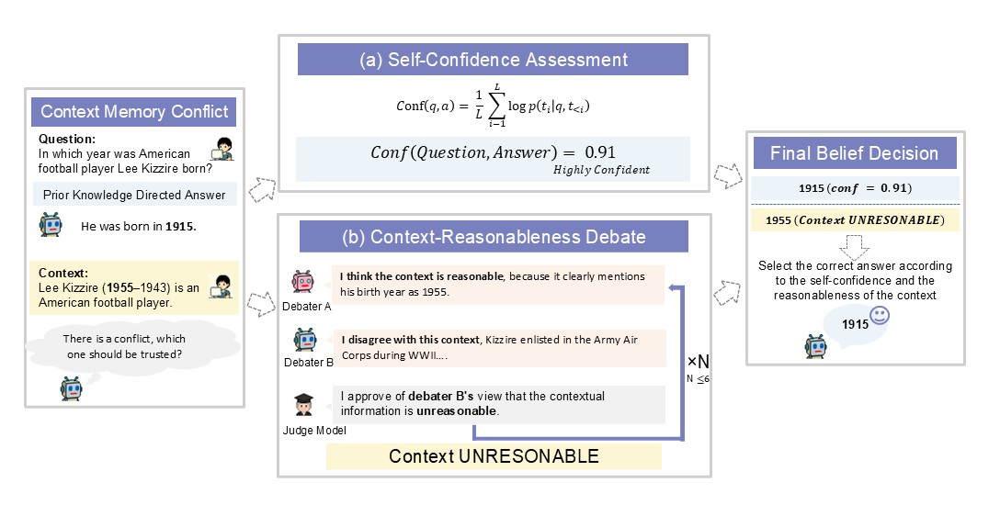

# 🧠 Self-Reflective Debates: When to Trust Context in LLMs

## 📜 Paper

> **When to Trust Context: Self-Reflective Debates for Context Reliability**  
> Zeqi Zhou*, Fang Wu*, Shayan Talaei*, Haokai Zhao, Cheng Meixin, Tinson Xu, Amin Saberi, Yejin Choi  
> [[PDF](https://arxiv.org/abs/2506.06020)]

This repository contains the code for **Self-Reflective Debate for Contextual Reliability (SR-DCR)**, a lightweight and interpretable framework for resolving conflicts between a language model’s parametric memory and external contextual input.

SR-DCR improves robustness to misleading context while maintaining accuracy on trustworthy passages. It combines token-level self-confidence with an asymmetric multi-agent debate to determine when to trust retrieved context in open-domain QA tasks.

## 🌟 Key Features

- **Asymmetric multi-agent debate** between a context-aware defender and a context-free critic.
- **Self-confidence estimation** to determine if the model already “knows” the answer.
- **Dynamic answer selection** based on judge verdict and confidence scores.
- Strong performance on the ClashEval benchmark with minimal overhead.


## 🔍 Method Overview

SR-DCR operates in three stages:
1. **Asymmetric Context Verification Debate (ACVD)**  
   One agent defends the context-based answer, while the other critiques using only the question.
2. **Self-Confidence Estimation**  
   The model computes its confidence in a prior-only answer (no context).
3. **Final Answer Selection**  
   The final answer is selected using both confidence score and a judge’s verdict on context reliability.

<p align="center">
  
</p>

## 📊 Results on ClashEval

SR-DCR achieves superior robustness across models:

| Model            | Standard Accuracy | Perturbed Accuracy | Overall |
|------------------|-------------------|---------------------|---------|
| GPT-3.5 Turbo    | 95.70%            | 29.66%              | **62.68%** |
| GPT-4o           | 94.67%            | 54.51%              | **74.59%** |
| Claude Haiku 3.5 | 95.33%            | 49.89%              | **72.61%** |
| LLaMA-3 70B      | 94.97%            | 28.39%              | **61.67%** |

## 🧪 Getting Started

### Installation

```bash
git clone https://github.com/smiles724/Self-Reflective-Debates.git
cd Self-Reflective-Debates
```

### Running the Pipeline

We provide scripts for:
- Sampling prior answers and confidence
- Launching debates
- Computing final answers
- Evaluating performance

## 📁 Repository Structure

```
Self-Reflective-Debates/
├── dataset_generation_and_knowledge_category/   # Scripts for generating QA data and annotating knowledge recall categories
├── methods/                                     # Implementation of SR-DCR, debate modules, and evaluation logic
```

## 📄 Citation

If you use our code or ideas, please cite our paper:

```bibtex
@article{zhou2025trust,
  title={When to Trust Context: Self-Reflective Debates for Context Reliability},
  author={Zhou, Zeqi and Wu, Fang and Talaei, Shayan and Zhao, Haokai and Meixin, Cheng and Xu, Tinson and Saberi, Amin and Choi, Yejin},
  journal={arXiv preprint arXiv:2506.06020},
  year={2025}
}
```

## 🛠 Acknowledgments

This project is a collaboration between Stanford University, Brown University, UNSW, and others. Equal contribution by Zeqi Zhou, Fang Wu, and Shayan Talaei.

---

For questions or issues, please contact [fangwu97@stanford.edu](mailto:fangwu97@stanford.edu).
